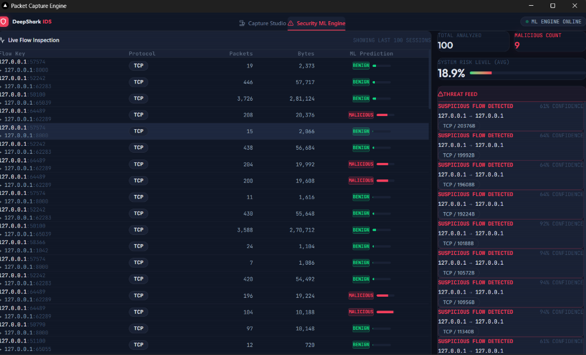
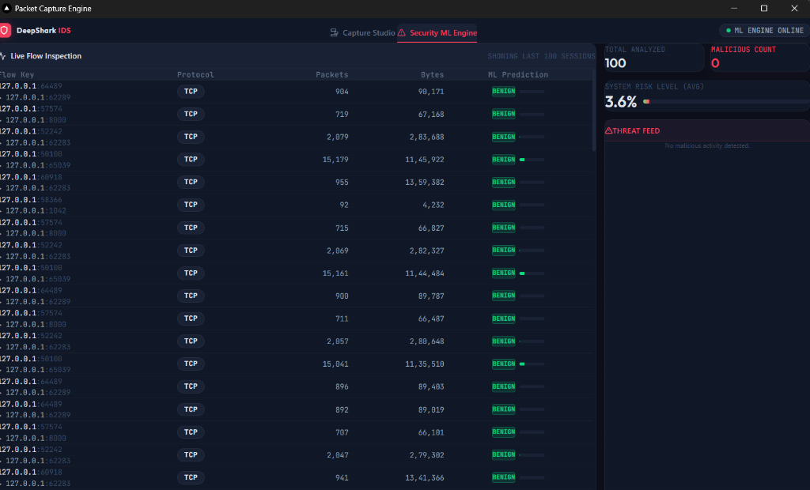
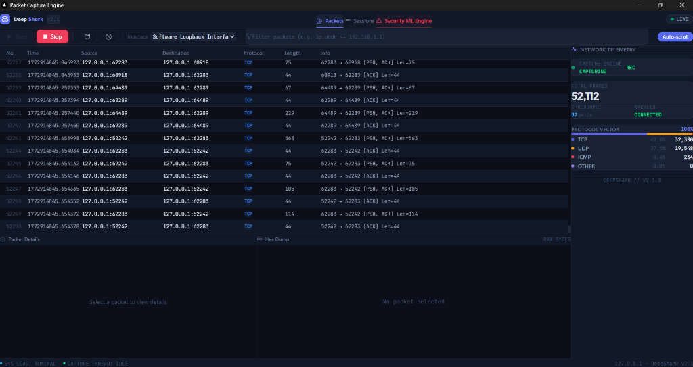

<div align="center">
  
  <h1>NetSentinel</h1>
  <p>A high-performance, real-time network packet analyzer with a Wireshark-inspired interface, built on a modern hybrid stack.</p>
</div>

---

## 📸 Screenshots
<div align="center">
  
  
  
</div>

---

## ⚠️ Important Requirements (Windows)
1. **[Npcap](https://npcap.com/) is Required:** Windows does not allow raw socket capture natively.
   *Download the free installer and make sure to check **"Install Npcap in WinPcap API-compatible Mode"** during setup.*

2. **Run as Administrator:** You MUST right-click the NetSentinel icon and select **"Run as Administrator"** every time you launch the app. If you don't, the packet capture engine and ML Engine will fail to start.

---

## ⚡ Features

- **Real-Time Capture:** Live packet streaming from network interfaces using WebSockets.
- **Deep Packet Inspection:** Scapy-powered backend parses layers (Ethernet, IPv4/IPv6, TCP, UDP, ICMP, DNS, Raw Payloads).
- **Wireshark-style Interface:** Dark-themed, high-density React UI with a fully virtualized packet table capable of handling thousands of rows without lag.
- **Hex Dump Viewer:** Inspect the raw hexadecimal bytes and ASCII payloads of any selected packet.
- **Dual Filtering System:**
  - **BPF Capture Filter:** High-performance adapter-level filtering (e.g., `tcp port 80`) to drop irrelevant packets before processing.
  - **Display Filter/Find:** Instant UI-level search (e.g., `192.168.1.1` or `HTTP`) without stopping the live capture.
- **Advanced ML Network Defense:** Real-time machine learning engine powered by Scikit-learn that extracts flow features to identify anomalies like Port Scans and DoS Floods dynamically.
- **Session Management:** Save captured traffic to standard `.pcap` files and load existing `.pcap` files for offline analysis.
- **Smart UAC Privilege Elevation:** The executable avoids annoying UAC prompts via registry-based automatic execution layer overrides.

---

## 🏗️ Architecture

NetSentinel is structured as a monorepo containing three main components:

1. **Frontend (`/frontend`)**
   - Built with **Next.js (React)**, **TypeScript**, and **Tailwind CSS**.
   - Uses **Zustand** for high-performance state management and `react-window` for list virtualization.
   - Exported as a purely static HTML/JS/CSS site (`next build && next export`).

2. **Backend (`/backend`) - Hybrid Layer 2+3+ Capture**
   - Built with **Python**, **nfstream**, and **Scapy**.
   - **Dual-Thread Packet Capture:**
     - **Thread 1 (nfstream):** Layer 3+ flow aggregation (IP, TCP, UDP, ICMP) — Primary capture engine
     - **Thread 2 (Scapy):** Layer 2 only (MAC addresses, ARP packets) — Secondary for L2 detection
   - **MAC Cache:** Thread-safe dictionary synchronizes MAC addresses from Scapy to nfstream flows
   - Streams flows via `websockets` (asyncio) to the frontend with both Layer 2 and Layer 3+ data

3. **Desktop Wrapper (PyWebView)**
   - The desktop window is spawned directly by the Python Backend using native Edge/Chromium OS hooks.
   - Hosts the static Next.js frontend in a fast, lightweight window without needing Electron.

4. **ML Risk Engine (`/ml_risk_engine`) - Production-Trained Model**
   - Built with **FastAPI**, **Scikit-learn (RandomForest)**, and **Pandas**.
   - **Trained on ISCX Dataset:** Binary classifier (Benign/Malicious) with 25 flow features extracted from network traffic
   - **Feature Set:** Flow duration, packet counts, byte counts, packet length statistics, inter-arrival time (IAT) statistics
   - **RobustScaler Normalization:** Applied at inference time to match training distribution
   - Subscribes to live packet capture stream and emits real ML predictions to the frontend
   - **Layer 2 Attack Detection:** Correlation engine detects ARP spoofing, MAC anomalies (same IP, different MACs)

---

## 🚀 Getting Started (Development)

Want to run the app locally from source? Follow these steps:

### Prerequisites (Windows)
1. **Node.js** (v18+)
2. **Python** (3.10+)
3. [**Npcap**](https://npcap.com/) — **Required!** Install Npcap in "WinPcap API-compatible Mode" to enable raw socket packet capturing on Windows.

### 1. Setup Backend
The backend uses Python to sniff packets.
```bash
cd backend
python -m venv venv
venv\Scripts\activate       # Activate virtual environment
pip install -r requirements.txt
```

### 2. Setup Frontend
The frontend is a standard Next.js application.
```bash
cd frontend
npm install
```

### 3. Run Locally
You must run the Python backend as an **Administrator**, or Scapy will fail to attach to network adapters.

**Terminal 1 (Admin):**
```bash
cd backend
venv\Scripts\activate
python main.py
```

**Terminal 2:**
```bash
cd frontend
npm run dev
```
Open your browser to `http://localhost:3000` to see the live app!

---

## 🧪 Testing with Loopback Interface

To test the ML engine and attack detection without a real network, use the loopback interface:

```bash
# Run the attack test suite
python backend/scripts/test_layer2_attacks.py --interface "Loopback" --count 5
```

This script simulates 7 different attack scenarios:
1. **ARP Spoofing** — Layer 2 detection (MAC spoofing)
2. **MAC Spoofing** — Same IP, multiple MACs
3. **SYN Flood** — TCP layer attack (expected risk: 0.93+)
4. **UDP Flood** — UDP layer attack (expected risk: 0.96+)
5. **Port Scan** — Multi-port connection attempts
6. **DNS Amplification** — Large packet floods (expected risk: 0.97+)
7. **Benign Traffic** — Normal baseline (expected risk: 0.97+ benign)

Watch the dashboard as attacks are generated in real-time. The ML model will classify flows as Benign or Malicious with confidence scores.

---

## 📦 Building the Executable Installer

If you want to package the app into a shareable `.exe` Windows Installer, the project uses a custom PowerShell build pipeline combining `PyInstaller` for one integrated backend/ML executable, `Next.js Export` for the UI, and `NSIS`.

Run the automated build script from the root directory as an Administrator:

```powershell
.\build-installer.ps1
```

The script will automatically:
1. Compile the integrated NetSentinel backend and ML engine into one executable
2. Export the React Frontend static site
3. Package everything into an NSIS installer

The final portable installer will be located at `backend/dist/NetSentinel-Setup.exe`.

If you're pushing this repo for others to clone and build, keep the source tree clean and run the build from the repository root. The packaged EXE will include the frontend export and the trained ML artifacts, so a fresh clone can be built without manual copying of generated files.

---

## 🛑 Git & Cache Files

If you are cloning this repository, note that we have a single, consolidated `.gitignore` in the root directory designed to keep the repo clean of:
- **Build Artifacts:** `dist/` installer binaries, `backend/build/`, `frontend/out/`, and `frontend/.next/`.
- **Dependencies:** `node_modules/` and Python `venv/` or `__pycache__/`.
- **User Data:** Environment files (`.env`) and any downloaded or recorded packet captures (`.pcap`, `.pcapng`).

## License

This project is licensed under the MIT License.
